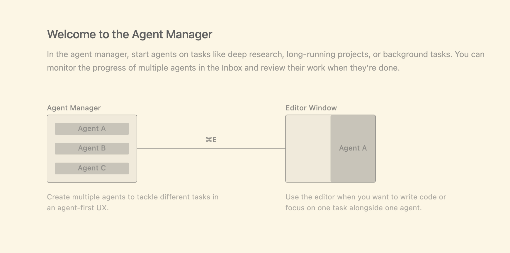

I am getting started with antigravity, will be using this post to capture key concepts and terminologies.

* Agent Manager & Editor

* AGY creates artiacts as it plans and gets work done to communicate its work done and get feedback on it. These could be markdown files, architecture diagrams, images, videos, code diffs, etc
    - Task Lists - before writing code, agent generates this structured plan
    - Implementation Plan - this is used to architect changes within the codebase to do a task & it contains a lot of technical details
    - Walkthrough - created once the task is completed, it summarizes changes & tells you how to test it
    - Code Diffs 
    - Screenshots - state of UI before and after the code changes
    - browser Recordings - for dynamic interactions, agent records the video of the session

* It is possible to interact with the artifacts by highlighting text and commenting on it. The agent will consider the feedback and iterate on it

* AntiGravity Browser subagent - AGY managed browser & can operate on the pages. It can click, scroll, read console logs, read DOM, click screenshots, make videos, parse markdoen etc.

Reference Links - https://codelabs.developers.google.com/getting-started-google-antigravity]