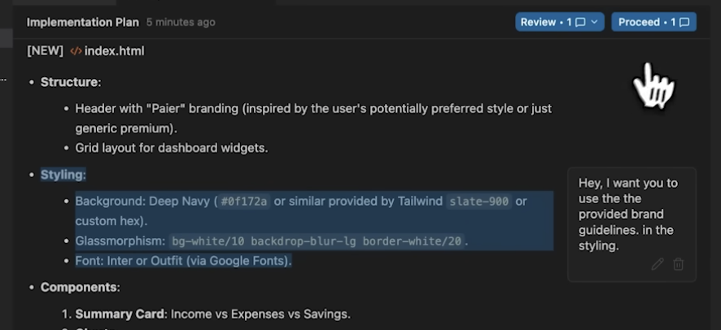

A  framework I learnt to get good at vibecoding from this [YT video](https://www.youtube.com/watch?v=QZCYFJTv8jI&t=199s)

**FLOW Framework** - Frame, Layout, Orchestrate, World

1. **F - Frame**
    - Be very specific about the problem you are solving
    - I like to do some brainstorming with Gemini/Claude to refine the problem further
    - Some starter prompts that have given me good results
        - "I will give you an overview of an app that I want to build. I want you to challenge my thinking and help me refine the problem. I am building a XYZ app that does the following things . . ."
        - After you refine your plan and use cases, use the prompt - "Now, I want you to write a structured SOP based on our discussion (not more than 500 words) that I can give to an AI to create a web App"
    - You can also give some reference mocks (generated by Gemini) along with the SOP 
 

2. **L - Layout**
    - The part where you can share design inspirations (fonts, styling, animations, interactions, etc)
    - Can share Dribble/Figma design images as attachments
    - E.g. Just create a file "brandGuidelines" in your folder structure & call it out later in artefacts

3. **O - Orchestrate**
    - AGY generates [artefacts](https://rohanchadha.github.io/posts/2026-01-03-antigravitygettingstarted/)
    - You can annotate those artefacts and add comments (see image below) nudging the agent in any direction of your choice
    - You can even nudge the agent to follow styling from your "brandGuidelines" file or an attached screenshots
    - Within any project workspace, you can fire up multiple concurrent agent that are doing different tasks (research, competitor analysis, etc)
    - E.g. "What are the top 5 Customer Support SaaS provideers from India? What features do they all have in common? Do a whole competitive analysis. And then create a document competetiveAnalysis.md and save it in the project files"
    - MCP Servers - Conecting AGY talk to other tools (github, vercel, BigQuery, n8n etc)
    - Customizations -> Workflows - These are saved prompts that an agent can follow. I can trigger a workflow by / (selecting the workflow) in agent input box
    
    

4. **W - World**
    - You can host what you build directly on Vercel or Github Pages
    - Just need to link your Github repo to Vercel. AGY updates GH which updates on Vercel