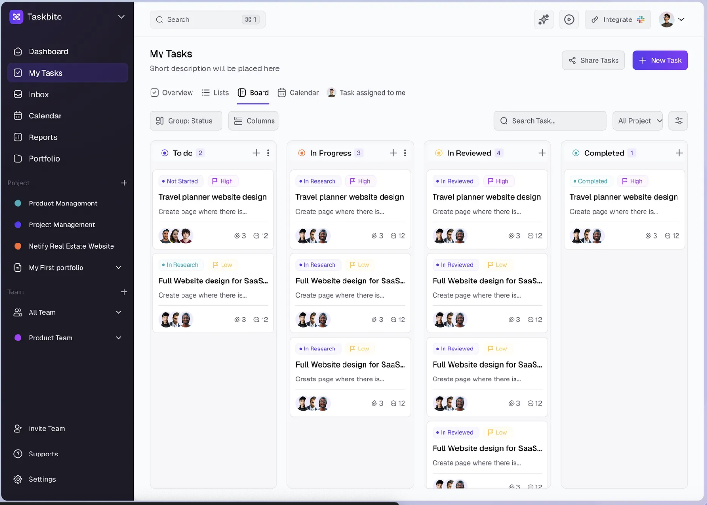

Ok, if you have a dashboard/website that you want to redesign based on a design inspiration from figma or dribbble, found the below prompt to work well.

### The Prompt

hey, this is great. I'd now like to change the design significantly. You should do the vast majority of your work in Tailwind or whatever style sheets that you're currently using to build this.  
  
In short, I think the design right now is very basic and super simple. I want you to add significantly more complexity using things like cool mouse hover effects on navbar elements on the left hand side. I want you to add really high quality icons. I'd like you to modernize the design significantly. I want you to try different fonts, higher quality fonts. I want you to use cutting edge, new ones that are on Google Fonts, etc. I want you to use some placeholder images so that the design feels alive, and I also want you to significantly upgrade the graph.  
  
What I've done is I've given you a screenshot from a similar design that I like a lot, and I want you to mimic more or less everything that you see here just as a start point. I'll modify the design slightly afterwards, but try and really nail the font colors, try and mimic the font styles, and try and mimic the encapsulation, the border styles, cards, etc.

### The design reference image

