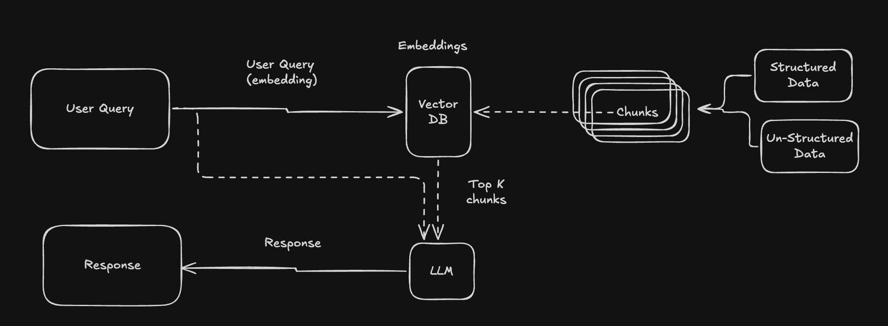
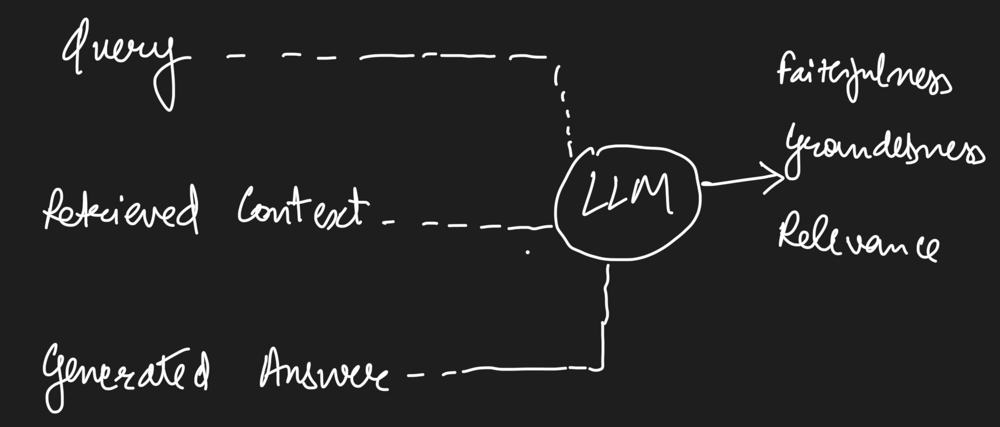
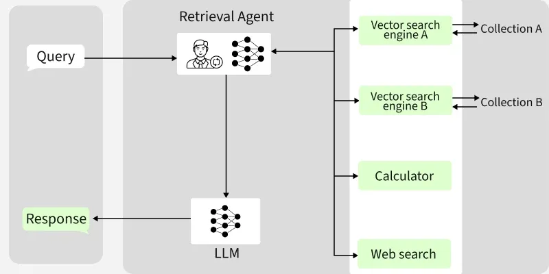
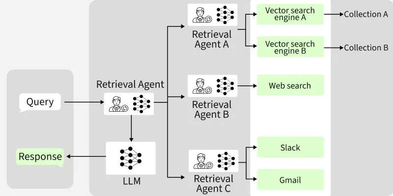
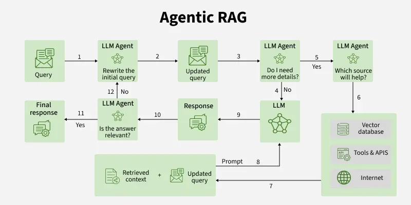

A RAG pipeline is 
- something that extracts internal knowledge using Vector DBs
- validates information using citation & confidence scoring
- produce safe, context aware answers using LLM

RAG stands for Retrieval-Augmented generation. It has a knowlege layer, retrieval layer, generation layer.

**Knowledge Layer**
- Can include Internal Documents (PDFs, Webpages, text, etc)
- Chunking (Split into smaller pieces by using different strategies)
- Converted to embeddings & Store into a Vector DB (for a semantic search)
- Also, store meta-data along with it for much better filtering later on

**Retrieval Layer**
- Embed the user query
- Execute a semantic search (can also do meta-data based filtering)
- Security Filters
- Top K chunks retrieval
- This is what will be additional context for LLMs

**Generation Layer**
- Pass top K chunks as knowledge to LLM to answer user query
- Elaborate system prompt on how to use the extracted chunks
- Validation Layer (Citing of sources)
    - Cite the sources
    - Confidence Scoring
    - Knowledge based validation before giving output
    - Adding Human in the loop for a High Risk Task

> Some Axis to think about when making RAG system - Safety, Governance, Validation, Approval Layers, Human Interference

## How to think about evals for RAG based systems?
Can breakdown evaluation on below basis:
- Retrieval Evaluation
- Generation Evalation

**Traditional Metrics** (should know but not very useful for real world rag app evals)
- BLEU
    - Measures n-gram overlap
    - Score b/w 0-1
- ROUGE
    - measures how much of reference text appears in the generated output
    - gauge how much of our important info is captured in LLMs response
- F1
    - Precision is Ability not to label a negative sample as positive
    - P = TP/(TP+FP)
    - Recall is ability to find all positive samples
    - R = TP/(TP+FN)
    - F1 score = P*R/(P+R)
    - F1 score is useful when correctness of specific pieces of information matter more than full sentences

> BLEU, ROGUE & F1 is mostly not enough for evaluation RAG systems

RAG Evaluation
**For retrieval**
- Context Precision = Relevant Chunks/(retrieved chunks)
- Context Recall = Retrieved Relevant Chunks/(total relevant chunks)
- Answer Relevance
- These metrics can be caluclated using the embeddings directly

**For Generation**
- **Faithfulness** checks whether the generated answer is supported by retrieved chunks or not
- If retrieved chunks usage high in Generated Answser - F is high & vice versa
- Caluclating this requires Deeper LLM reasoning OR Human in the loop

**LLM-as-a-judge**
- Using LLM to gauge the relevancy of the generated answer

- An open source framework RAGAS provides RAG evals out-of-the-box
- Provides scores for Faithfullness, Context Precision, Context Recall, Answer Relevance
- usually a good practice to compare 2 answer pairs side by side rather than caluclating these metrics in isolation
- Use similar length responses for compariosn (sometimes llms prefer longer length answers)

## Types of Agentic RAG systems

1. Single Agent

2. Multi Agent 

3. Agentic Orchestration

- Query Input: The user submits a query, initiating the process.
- Query Refinement: An LLM agent reviews and rewrites the query for clarity, if needed, ensuring optimal data retrieval.
- Information Sufficiency: The agent checks if further details are needed. If so, more information is gathered before proceeding.
- Source Selection: The agent determines the best source for the query—vector database, APIs/tools or internet based on context.
- Data Retrieval: The chosen source is queried and relevant context is collected.
- Context Integration: Retrieved context is combined with the updated query to enrich understanding.
Response Generation: The LLM produces a response using the enhanced context and query.
- Answer Validation: The agent verifies whether the response is relevant to the original question.
- Final Output: If validated, the system delivers a precise, context-aware final response.

Course Link - https://aianalystlab.ai/ai-evals-course/w1-l2-product-evaluation-framework/